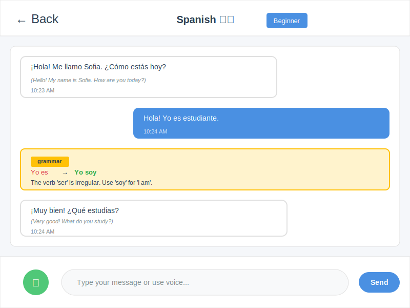

# Babblr

A desktop language learning app that lets you speak naturally with an AI tutor. Learn Spanish, Italian, German, French, or Dutch through immersive conversations with adaptive difficulty.

## Features

🗣️ **Natural Conversation**: Speak naturally with Claude AI, not like a textbook  
🎤 **Voice Recording**: Record your speech and get instant transcription via Whisper  
✨ **Error Correction**: Get gentle, contextual corrections on grammar and vocabulary  
🔊 **Text-to-Speech**: Hear natural pronunciation with multi-language TTS  
📚 **Vocabulary Tracking**: Automatically track new words and phrases  
🎯 **Adaptive Difficulty**: CEFR levels (A1-C2) that match your skills  
💼 **Topic-Based Learning**: Choose conversation topics (business, travel, shopping, restaurants, etc.)  
💾 **Conversation History**: Save and continue your learning sessions

## What It Looks Like

### Home Screen
Select your target language, difficulty level, and access recent conversations:


### Conversation Screen
Interact with the AI tutor through voice or text, receive corrections, and track your progress:



### Assessment Screen
Take CEFR placement tests to determine your proficiency level and get personalized recommendations:


**Key UI Features:**
- **Language Selection**: Choose from Spanish 🇪🇸, Italian 🇮🇹, German 🇩🇪, French 🇫🇷, or Dutch 🇳🇱
- **Voice Input**: Green microphone button for speech-to-text
- **Real-time Corrections**: Yellow panel shows grammar and vocabulary corrections
- **Natural Chat Interface**: Conversational bubbles with timestamps
- **Audio Playback**: Automatic text-to-speech for AI responses
- **CEFR Assessments**: Placement tests with skill breakdown and level recommendations

For a detailed visual walkthrough and UI specifications, see the [Visual Guide](VISUAL_GUIDE.md).

## Tech Stack

### Frontend
- **Electron**: Desktop application framework
- **React**: UI library
- **TypeScript**: Type-safe development
- **Vite**: Fast build tool

### Backend
- **FastAPI**: Modern Python web framework
- **OpenAI Whisper**: Speech-to-text transcription
- **Anthropic Claude**: AI conversation and error correction
- **Edge TTS**: Free text-to-speech synthesis
- **SQLite**: Local database for conversations and vocabulary

## Getting Started

### Docker (Easiest for Development)

Run the entire stack with hot-reload using Docker Compose:

```bash
cd docker
cp .env.template .env
# Edit .env if you want to use Claude/Gemini instead of Ollama
docker-compose -f docker-compose.base.yml -f docker-compose.dev.yml up -d
```

This starts backend, frontend, PostgreSQL, and Ollama in containers with automatic code reloading.

See [docker/README.md](docker/README.md) for detailed Docker setup and troubleshooting.

### Quick Setup (Native Installation)

Use the automated setup script with uv package manager:

**Linux/macOS:**
```bash
# Run the setup script (installs uv if needed)
./setup.sh
```

**Windows:**
```cmd
REM Run the setup script (installs uv if needed)
setup.bat
```

This will:
- Install uv (fast Python package manager) if not present
- Set up backend with uv virtual environment
- Install all dependencies
- Set up frontend

**Windows users:** Use `setup.bat` instead of `./setup.sh`

See [backend/UV_SETUP.md](backend/UV_SETUP.md) for detailed uv usage and troubleshooting.

### Prerequisites

- **Python 3.12+** (3.13 not required, but 3.12 recommended for latest features)
- **Node.js 22+ LTS** (or Node.js 24+ for latest performance and security)
- **uv** (automatically installed by setup.sh, or install manually: `curl -LsSf https://astral.sh/uv/install.sh | sh`)
- **Anthropic API Key** - See [ENVIRONMENT.md](ENVIRONMENT.md) for how to get and configure API keys

### Manual Backend Setup

1. Install uv (if not already installed):
```bash
curl -LsSf https://astral.sh/uv/install.sh | sh
```

2. Navigate to the backend directory:
```bash
cd backend
```

3. Create virtual environment and install dependencies with uv:
```bash
# Create venv and install all dependencies
uv venv
uv pip install -e ".[dev]"
```

4. **Configure environment variables:**

   See **[ENVIRONMENT.md](ENVIRONMENT.md)** for detailed instructions on:
   - Getting your Anthropic API key
   - All available configuration options
   - Troubleshooting common issues

   **Quick start:**
   ```bash
   cp .env.example .env
   # Edit .env and add your ANTHROPIC_API_KEY
   ```

5. Run the backend:
```bash
# Using uv (recommended)
source .venv/bin/activate
babblr-backend

# Or using the run script
cd ..
./run-backend.sh
```

The API will be available at http://localhost:8000

### Frontend Setup

1. Navigate to the frontend directory:
```bash
cd frontend
```

2. Install dependencies:
```bash
npm install
```

3. Run in development mode:
```bash
npm run electron:dev
```

This will start both the Vite dev server and Electron.

### Building for Production

Build the frontend:
```bash
cd frontend
npm run build
npm run electron:build
```

The built application will be in `frontend/release/`.

## Usage

1. **Start a Conversation**: Select your target language, difficulty level, and choose a conversation topic
2. **Assessment (optional)**: Take a placement test instead of selecting the difficulty level to get a recommended CEFR level (A1-C2)
3. **Talk or Type**: Use the microphone button to speak, or type your message
4. **Get Feedback**: See corrections and explanations for your mistakes
5. **Listen**: Hear the AI tutor's response with natural pronunciation
6. **Track Progress**: Review your conversation history and vocabulary

## Supported Languages

- 🇪🇸 Spanish
- 🇮🇹 Italian
- 🇩🇪 German
- 🇫🇷 French
- 🇳🇱 Dutch

## API Documentation

Once the backend is running, visit:
- **Swagger UI**: http://localhost:8000/docs
- **ReDoc**: http://localhost:8000/redoc

## Testing

### Backend Tests

Run unit tests (don't require backend running):
```bash
cd backend
pytest tests/test_unit.py -v
```

Run integration tests (requires backend to be running):
```bash
# Terminal 1: Start backend
./run-backend.sh

# Terminal 2: Run tests
cd backend
pytest tests/test_integration.py -v
```

Run all tests:
```bash
cd backend
pytest tests/ -v
```

See `backend/tests/README.md` for more details.

## Architecture

```
babblr/
├── backend/
│   ├── app/
│   │   ├── main.py              # FastAPI application
│   │   ├── config.py            # Configuration
│   │   ├── database/            # Database setup
│   │   ├── models/              # SQLAlchemy & Pydantic models
│   │   ├── routes/              # API endpoints
│   │   └── services/            # AI service integrations
│   └── requirements.txt
│
└── frontend/
    ├── electron/
    │   └── main.js              # Electron main process
    ├── src/
    │   ├── components/          # React components
    │   ├── services/            # API client
    │   ├── types/               # TypeScript types
    │   └── App.tsx              # Main app component
    └── package.json
```

## Development Philosophy

This app focuses on:
- **Natural conversation** over gamification
- **Adaptive difficulty** that grows with you
- **Immersive learning** through practical use
- **Free/affordable** APIs and local processing

## Free Tier Limits

- **Claude (Anthropic)**: Check current free tier at anthropic.com
- **Whisper**: Runs locally, no API limits
- **Edge TTS**: Free Microsoft TTS service

## Contributing

Babblr is a public project. Contributions are welcome — especially small, well-scoped PRs.

- **Start with a PR**: issues are **not assigned by default**. You do not need permission to start work. You can add a comment to the issue.
- **Fork-first workflow**: external contributors should **fork**, create a branch in their fork, and open a PR.
- **CLA required**: submitting a PR means you agree to the [Contributor License Agreement](CLA.md). Include **"I agree to the Babblr CLA"** in the PR description (or first comment).
- **Agentic coding is encouraged**: if you used an AI agent, please paste the key prompts, conversations, and short decisions/trade-offs in the PR description or comments.
- **First high-quality PR may be merged**: if multiple people work on the same issue, we may merge the first PR that meets the bar.
- **Required checks**: GitHub Actions (linting/testing) must be green before merge.
- **Required reviews**:
  - **PR submitter responsibility**: you are responsible for reviewing any AI-generated code before submitting, and for addressing review feedback.
  - **Maintainer reviews before merge**: maintainers will do an AI-assisted review and a human review before merge. We may ask for changes, or (in some cases) merge with small maintainer edits.

See [CONTRIBUTING.md](CONTRIBUTING.md) for the full workflow.

## Licensing

Babblr is **dual-licensed**:

- **Open source license (AGPL-3.0)**: You may use, modify, and distribute Babblr under the terms of the GNU Affero General Public License v3.  
  Important: If you run a modified version and make it available to users over a network, you must offer the corresponding source code to those users (AGPL network copyleft).
- **Commercial license**: If you want to use Babblr in a **proprietary / closed-source** product or service (for example, you cannot comply with AGPL source-sharing requirements), you must obtain a commercial license.

See:
- [LICENSE](LICENSE) (AGPL-3.0)
- [COMMERCIAL_LICENSE.md](COMMERCIAL_LICENSE.md) (commercial terms overview + how to request)
- [LICENSING.md](LICENSING.md) (plain-English guidance)
- [POLICIES.md](POLICIES.md) (acceptable use + AI output disclaimer)
- [TRADEMARKS.md](TRADEMARKS.md) (branding guidance)

## Acknowledgments

- OpenAI for Whisper
- Anthropic for Claude
- Microsoft for Edge TTS
