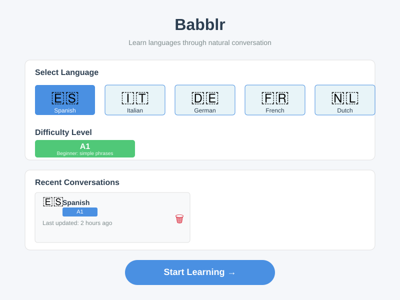
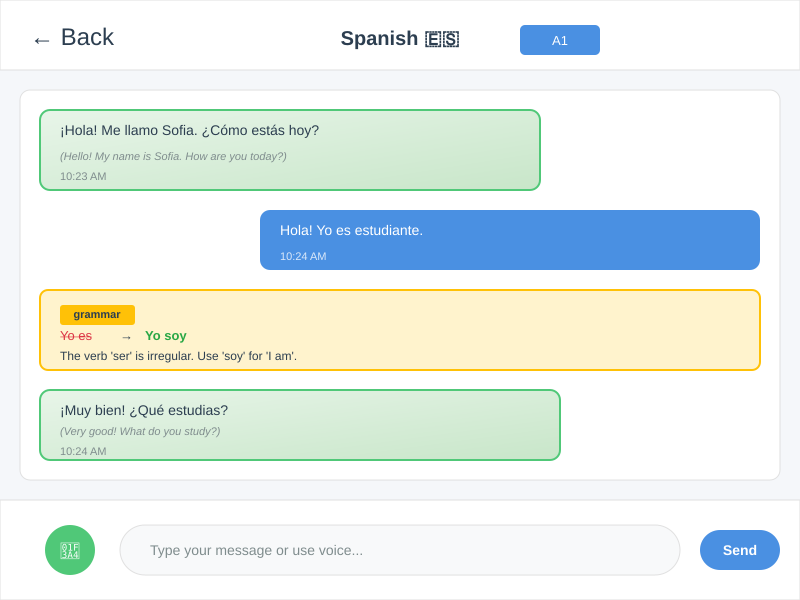
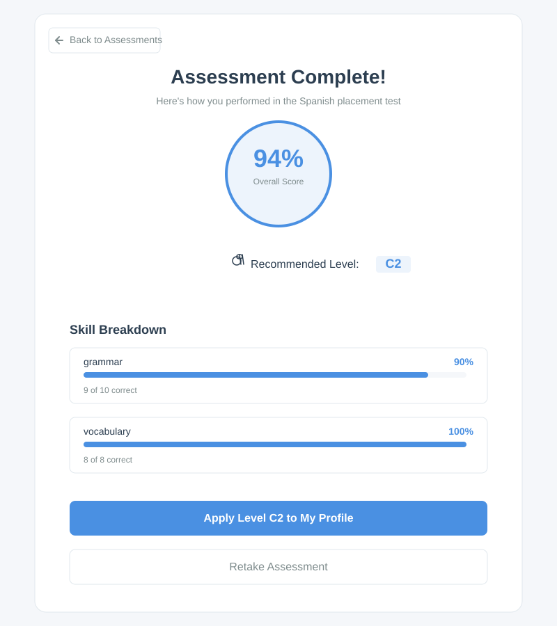

# Babblr

A desktop language learning app that lets you speak naturally with an AI tutor. Practice **English, Spanish, Italian, German, French, and Dutch** through immersive conversations, structured grammar and vocabulary lessons, and CEFR placement assessments — all with adaptive difficulty (A1–C2).

Babblr runs on your machine: your conversations stay local, and you choose which AI backend to use — a fully offline local model (Ollama), or a hosted provider (Claude, Gemini) when you want higher quality.

## Features

🗣️ **Natural conversation** — Practice speaking with an AI tutor that adapts to your level, not a scripted textbook  
🎤 **Voice input** — Record your speech and get instant transcription via local Whisper  
✨ **Adaptive error correction** — Gentle, level-appropriate corrections (beginners are corrected softly and rarely; advanced learners more strictly)  
🔊 **Text-to-speech** — Hear natural pronunciation, with playback speed tuned to your level  
📚 **Vocabulary lessons** — Structured, topic-based vocabulary with translations and examples  
📖 **Grammar lessons with spaced repetition** — Grammar rules and exercises scheduled for review based on your mastery  
🎯 **CEFR assessments** — Placement tests that score you per skill (grammar, vocabulary, listening) and recommend a level  
📈 **Progress tracking** — Follow your level and lesson history over time  
🔌 **Swappable AI backends** — Local Ollama (offline, default), Claude, or Gemini via a single provider abstraction  
💾 **Conversation history** — Save and resume your learning sessions

## How Babblr teaches

Babblr is not a thin wrapper over a chatbot. Its tutoring behavior is grounded in second-language-acquisition research and encoded in the backend:

- **Comprehensible input (Krashen's _i+1_)** — The tutor targets language just above your current level: you understand most of what you hear and stretch for the rest. CEFR level templates (`backend/templates/prompts/`) cap sentence length, vocabulary size, and grammar complexity per level.
- **Communicative approach** — Learning happens through meaningful conversation on real topics (travel, shopping, business…), not isolated drills. No streaks, XP, or leaderboards.
- **Level-differentiated correction** — Correction strategy changes with level: at A1 the tutor ignores punctuation and diacritics and offers at most one gentle correction; higher levels get stricter, more detailed feedback.
- **90% coverage principle** — A newer modular prompt system (`backend/app/services/modular_prompt_builder.py`) composes tutor identity, level constraints, roleplay context, and correction strategy so learners recognize ~90% of vocabulary and grammar from lessons at or below their level.

For the full pedagogical rationale see [docs/prd/00-vision/product-principles.md](docs/prd/00-vision/product-principles.md); for how curriculum and lessons are generated see [docs/curriculum/lesson-creation.md](docs/curriculum/lesson-creation.md).

## What it looks like

The app is organized into tabs: **Home, Vocabulary, Grammar, Conversations, Assessments, Progress, and Configuration**. Active-conversation state is preserved as you switch tabs.

### Home screen
Select your target language and difficulty level, and jump back into recent conversations:



### Conversation screen
Talk or type with the AI tutor, receive corrections, and hear responses read aloud:



### Assessment screen
Take a CEFR placement test to determine your level, with a per-skill breakdown and recommendations:



For a detailed visual walkthrough and UI specifications, see the [Visual Guide](VISUAL_GUIDE.md).

## Tech stack

### Frontend
- **Electron** + **React 19** + **TypeScript** — desktop application
- **Vite** — build tool and dev server
- **Vitest** — unit tests

### Backend
- **FastAPI** (async) — Python web framework
- **SQLAlchemy 2 (async)** with **SQLite** by default, or **PostgreSQL** (asyncpg) under Docker
- **LangChain** — prompt construction and provider integrations
- **Swappable LLM providers** — Ollama (local, default), Anthropic Claude, Google Gemini, and a mock provider, behind a single factory
- **OpenAI Whisper** — local speech-to-text (with an optional external Whisper webservice)
- **Edge TTS** — free text-to-speech synthesis
- **uv** — Python dependency and environment management

## Getting the code

```bash
git clone https://github.com/pkuppens/babblr.git
cd babblr
```

## Prerequisites

- **Python 3.12+** (backend requires `>=3.12,<3.15`)
- **Node.js 22+ LTS** (Node 24 also supported)
- **uv** — installed automatically by the setup scripts, or manually: `curl -LsSf https://astral.sh/uv/install.sh | sh`
- **An AI backend** — either [Ollama](https://ollama.com/) for offline use (default), or an **Anthropic** / **Google** API key. See [ENVIRONMENT.md](ENVIRONMENT.md) for how to get and configure keys.

> [!TIP]
> The fastest way to run the full stack (backend, frontend, PostgreSQL, and Ollama) is Docker Compose — see below. It needs only Docker installed.

## Getting started

### Docker (easiest for development)

Runs the entire stack with hot-reload:

```bash
cd docker
cp .env.template .env
# Edit .env if you want to use Claude/Gemini instead of the bundled Ollama
docker-compose -f docker-compose.base.yml -f docker-compose.dev.yml up -d
```

This starts backend, frontend, PostgreSQL, and Ollama with automatic code reloading. See [docker/README.md](docker/README.md) for detailed setup and troubleshooting.

### Native setup (setup scripts)

**Linux/macOS:**
```bash
./setup.sh
```

**Windows:**
```cmd
setup.bat
```

The script installs `uv` if needed, creates the backend virtual environment (`backend/.venv`), and installs backend and frontend dependencies. See [backend/UV_SETUP.md](backend/UV_SETUP.md) for details.

### Manual backend setup

```bash
cd backend

# Create the virtual environment and install dependencies
uv sync --group dev

# Configure environment (see ENVIRONMENT.md for details)
cp .env.example .env
# Edit .env — set LLM_PROVIDER and any API keys you need

# Run the backend
uv run uvicorn app.main:app --reload
# or, from the project root: ./run-backend.sh
```

The API is served at http://localhost:8000. Confirm it is up by opening the interactive docs at http://localhost:8000/docs.

### Frontend setup

```bash
cd frontend
npm install
npm run electron:dev
```

This starts the Vite dev server (on port 5173) and launches Electron once it is ready.

### Building for production

```bash
cd frontend
npm run build            # TypeScript + Vite build
npm run electron:build   # Create a distributable via electron-builder
```

The built application lands in `frontend/release/`.

## Usage

1. **Choose a language and level** on the Home screen — or take a placement test in **Assessments** to get a recommended CEFR level (A1–C2).
2. **Start a conversation** and pick a topic (business, travel, shopping, restaurants…).
3. **Talk or type** — use the microphone to speak, or type your message.
4. **Get feedback** — see level-appropriate corrections and explanations.
5. **Study lessons** — reinforce with Grammar and Vocabulary lessons; grammar items return for spaced-repetition review.
6. **Track progress** — review your level and history on the Progress screen.

## Supported languages

Full conversational practice (speech-to-text **and** text-to-speech):

- 🇬🇧 English
- 🇪🇸 Spanish
- 🇮🇹 Italian
- 🇩🇪 German
- 🇫🇷 French
- 🇳🇱 Dutch

Portuguese is available for text-to-speech (listening) but not yet for speech input. See [backend/app/services/language_catalog.py](backend/app/services/language_catalog.py) for the authoritative list.

> [!NOTE]
> Content depth is deepest for Spanish today; other languages have lighter seed curricula. Expanding parity across languages is active work.

## Architecture

```
babblr/
├── backend/
│   └── app/
│       ├── main.py                 # FastAPI entry point, router registration
│       ├── config.py               # Settings from environment variables
│       ├── database/               # Async SQLAlchemy setup
│       ├── models/                 # ORM models + Pydantic schemas
│       ├── grammar/                # Grammar lesson domain (models, service, spaced repetition)
│       ├── routes/                 # API endpoints
│       │   ├── chat.py             # Conversation with the LLM
│       │   ├── conversations.py    # Conversation CRUD
│       │   ├── topics.py           # Topic suggestions
│       │   ├── vocabulary.py       # Vocabulary lessons
│       │   ├── grammar.py          # Grammar lessons + exercises
│       │   ├── lessons.py          # Unified lesson listing
│       │   ├── assessments.py      # CEFR placement tests
│       │   ├── progress.py         # Progress tracking
│       │   ├── user_levels.py      # Per-user level state
│       │   ├── stt.py              # Speech-to-text (Whisper)
│       │   └── tts.py              # Text-to-speech (Edge TTS)
│       └── services/
│           ├── llm/                # Swappable LLM providers (factory + base)
│           ├── stt/                # Swappable STT providers (local/external/mock)
│           ├── prompt_builder.py           # CEFR prompt templates
│           ├── modular_prompt_builder.py   # Composable prompt system ("90% coverage")
│           ├── scoring_service.py          # Assessment scoring + recommendations
│           ├── conversation_service.py     # Conversation business logic
│           ├── whisper_service.py          # Local Whisper STT
│           └── tts_service.py              # Edge TTS
│
└── frontend/
    ├── electron/                   # Electron main process
    └── src/
        ├── App.tsx                 # Tab navigation + global state
        ├── screens/                # Home, Vocabulary, Grammar, Conversations, Assessments, Progress, Configuration
        ├── components/             # Reusable React components
        ├── hooks/                  # Custom hooks (audio recorder, TTS, retry)
        ├── services/               # API client + settings persistence
        └── types/                  # TypeScript types
```

The backend follows a layered design (routes → services → repositories/storage) with abstractions injected via factories, so LLM, STT, and prompt strategies can be swapped by configuration. See [docs/ARCHITECTURE.md](docs/ARCHITECTURE.md) and [docs/DATABASE_SCHEMA.md](docs/DATABASE_SCHEMA.md).

## API documentation

With the backend running:
- **Swagger UI**: http://localhost:8000/docs
- **ReDoc**: http://localhost:8000/redoc

## Testing

### Backend (from `backend/`)

```bash
uv run pytest tests/test_unit.py -vv --tb=short -n 8            # Unit tests (no server)
uv run pytest tests/test_llm_providers.py -vv --tb=short -n 8   # LLM provider tests (mocked)
uv run pytest tests/test_integration.py -vv --tb=short -n 8     # Integration tests (server must be running)
uv run pytest tests/ -vv --tb=short -n 8                         # All tests
```

Integration tests use the `@pytest.mark.integration` marker. See [backend/tests/README.md](backend/tests/README.md).

### Frontend (from `frontend/`)

```bash
npm run test            # Run once
npm run test:watch      # Watch mode
npm run test:coverage   # With coverage
```

## Development philosophy

Babblr focuses on:
- **Natural conversation** over gamification
- **Adaptive difficulty** that grows with you
- **Immersive learning** through practical use
- **Privacy-first, offline-capable** operation — your data stays local, and you pick your AI provider

## Contributing

Babblr is a public project. Contributions are welcome — especially small, well-scoped PRs.

- **Start with a PR**: issues are **not assigned by default**. You do not need permission to start work. You can add a comment to the issue.
- **Fork-first workflow**: external contributors should **fork**, create a branch in their fork, and open a PR.
- **CLA required**: submitting a PR means you agree to the [Contributor License Agreement](CLA.md). Include **"I agree to the Babblr CLA"** in the PR description (or first comment).
- **Agentic coding is encouraged**: if you used an AI agent, please paste the key prompts, conversations, and short decisions/trade-offs in the PR description or comments.
- **First high-quality PR may be merged**: if multiple people work on the same issue, we may merge the first PR that meets the bar.
- **Required checks**: GitHub Actions (linting/testing) must be green before merge.
- **Required reviews**:
  - **PR submitter responsibility**: you are responsible for reviewing any AI-generated code before submitting, and for addressing review feedback.
  - **Maintainer reviews before merge**: maintainers will do an AI-assisted review and a human review before merge. We may ask for changes, or (in some cases) merge with small maintainer edits.

See [CONTRIBUTING.md](CONTRIBUTING.md) for the full workflow and [POLICIES.md](POLICIES.md) for git/commit conventions.

## Licensing

Babblr is **dual-licensed**:

- **Open source license (AGPL-3.0)**: You may use, modify, and distribute Babblr under the terms of the GNU Affero General Public License v3. If you run a modified version and make it available to users over a network, you must offer the corresponding source code to those users (AGPL network copyleft).
- **Commercial license**: If you want to use Babblr in a **proprietary / closed-source** product or service, you must obtain a commercial license.

See:
- [LICENSE](LICENSE) (AGPL-3.0)
- [COMMERCIAL_LICENSE.md](COMMERCIAL_LICENSE.md) (commercial terms overview + how to request)
- [LICENSING.md](LICENSING.md) (plain-English guidance)
- [POLICIES.md](POLICIES.md) (acceptable use + AI output disclaimer)
- [TRADEMARKS.md](TRADEMARKS.md) (branding guidance)

## Acknowledgments

- OpenAI for Whisper
- Anthropic for Claude
- Google for Gemini
- Ollama for local model serving
- Microsoft for Edge TTS
