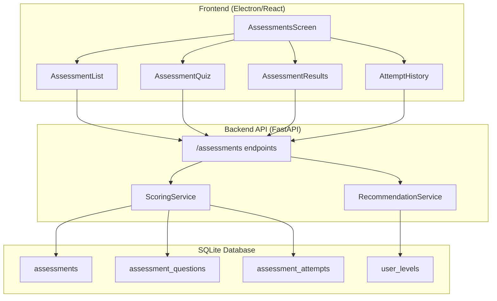
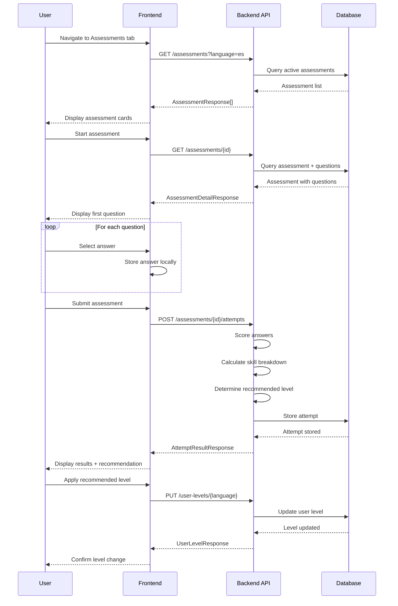
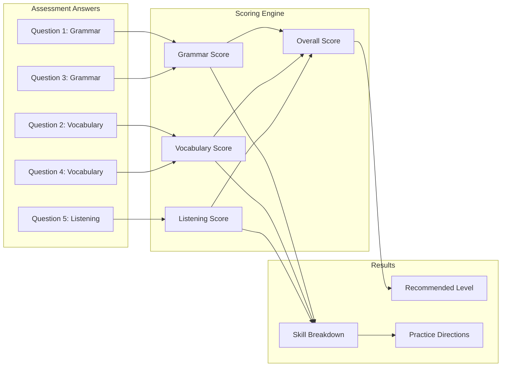

# Babblr Architecture

This document describes the high-level architecture of Babblr.

## Overview

Babblr is a desktop language learning application built with:
- **Frontend**: Electron + React + TypeScript
- **Backend**: Python FastAPI
- **Database**: SQLite (async via SQLAlchemy)

```
+------------------+     HTTP/REST     +------------------+
|                  | <---------------> |                  |
|  Electron App    |                   |  FastAPI Server  |
|  (React + TS)    |                   |  (Python)        |
|                  |                   |                  |
+------------------+                   +--------+---------+
                                               |
                                               v
                                       +-------+--------+
                                       |                |
                                       |  SQLite DB     |
                                       |  (babblr.db)   |
                                       |                |
                                       +----------------+
```

## Backend Architecture

### Directory Structure

```
backend/app/
├── main.py                 # FastAPI entry point
├── config.py               # Settings from environment
├── database/               # SQLAlchemy setup
├── models/
│   ├── models.py           # ORM models
│   └── schemas.py          # Pydantic schemas
├── routes/                 # API endpoints
│   ├── chat.py             # Conversation with LLM
│   ├── conversations.py    # CRUD operations
│   ├── stt.py              # Speech-to-text
│   └── tts.py              # Text-to-speech
└── services/
    ├── llm/                # LLM provider abstraction
    │   ├── base.py         # Abstract base class
    │   ├── factory.py      # Provider factory
    │   └── providers/      # Implementations
    ├── whisper_service.py  # Local Whisper STT
    └── tts_service.py      # Edge TTS
```

### LLM Provider Pattern

All LLM providers implement `BaseLLMProvider`:

```python
class BaseLLMProvider(ABC):
    @abstractmethod
    async def generate(self, messages, system_prompt) -> str: ...

    @abstractmethod
    async def health_check(self) -> bool: ...
```

Available providers:
- `claude`: Anthropic Claude API
- `ollama`: Local Ollama instance
- `mock`: Testing mock

Use `ProviderFactory.get_provider(name)` to instantiate.

## Frontend Architecture

### Directory Structure

```
frontend/src/
├── App.tsx                 # Main application
├── components/             # React components
└── services/
    └── api.ts              # Axios API client
```

## Data Flow

### Conversation Flow

```
User speaks
    |
    v
[Whisper STT] --> Text --> [LLM Provider] --> Response
    |                                              |
    v                                              v
Transcription                              [Edge TTS]
                                                   |
                                                   v
                                            Audio playback
```

### Database Schema

See `docs/DATABASE_SCHEMA.md` for complete database schema documentation including:
- Entity relationship diagrams (Mermaid)
- Detailed table definitions
- Relationships and constraints
- Validation rules
- Planned schema extensions

Current tables:
- `conversations`: Conversation sessions
- `messages`: Individual messages within conversations

Planned vocabulary tables (static, offline-filled):
- `words`: Base vocabulary words predefined by language and difficulty level
- `word_meanings`: Multiple meanings per word
- `word_forms`: Word variations (plural, conjugations, etc.)
- `word_difficulty_levels`: Associates words with CEFR levels (A1-C2) - enables offline vocabulary curation per level
- `word_synonyms`: Synonym relationships between words
- `word_examples`: Example sentences for word meanings
- `user_word_progress`: Tracks user progress with individual words

See `docs/DATABASE_SCHEMA.md` for complete vocabulary architecture documentation.

## CEFR Assessment Architecture

The CEFR Assessment feature enables users to take placement tests to determine their proficiency level and receive personalized practice recommendations.

### Component Overview



### Assessment Data Flow



### Scoring Model



### CEFR Level Mapping

The scoring service maps overall percentage scores to CEFR levels:

| Score Range | Recommended Level | Description |
|-------------|-------------------|-------------|
| 0-20%       | A1                | Beginner |
| 21-40%      | A2                | Elementary |
| 41-60%      | B1                | Intermediate |
| 61-80%      | B2                | Upper Intermediate |
| 81-90%      | C1                | Advanced |
| 91-100%     | C2                | Proficient |

### Skill Categories

Assessments test multiple skill categories:

- **grammar**: Verb conjugations, sentence structure, tense usage
- **vocabulary**: Word meanings, translations, usage in context
- **listening**: (Future) Audio comprehension exercises

Each question is tagged with a skill category, enabling per-skill score breakdowns.

### API Endpoints

| Endpoint | Method | Description |
|----------|--------|-------------|
| `/assessments` | GET | List available assessments for a language |
| `/assessments/{id}` | GET | Get assessment with questions (no answers) |
| `/assessments/{id}/attempts` | POST | Submit answers and get scored results |
| `/assessments/attempts` | GET | List user's attempt history |
| `/user-levels/{language}` | GET | Get user's current CEFR level |
| `/user-levels/{language}` | PUT | Update user's CEFR level |

### Results Display

```
+--------------------------------------------------+
|             CEFR Assessment Results              |
+--------------------------------------------------+
|                                                  |
|  Overall Score: 72%                              |
|  ==========================================      |
|                                                  |
|  Recommended Level: B1 (Intermediate)            |
|                                                  |
|  +------------------------------------------+   |
|  |           Skill Breakdown                |   |
|  +------------------------------------------+   |
|  |                                          |   |
|  |  Grammar      [========----] 80%         |   |
|  |  Vocabulary   [=======-----] 70%         |   |
|  |  Listening    [======------] 60%         |   |
|  |                                          |   |
|  +------------------------------------------+   |
|                                                  |
|  Areas to Focus:                                 |
|  - Listening comprehension needs practice        |
|  - Review vocabulary for travel topics           |
|                                                  |
|  +------------------------------------------+   |
|  | [Apply B1 Level]    [Retake Assessment]  |   |
|  +------------------------------------------+   |
|                                                  |
+--------------------------------------------------+
```

## Decision Records

### ADR-001: LLM Provider Abstraction

**Context**: Support multiple LLM backends (Claude, Ollama, local models).

**Decision**: Use abstract base class with factory pattern.

**Consequences**: Easy to add new providers, but adds abstraction layer.

### ADR-002: CEFR Assessment Skill Breakdown

**Context**: Users need actionable feedback on their assessment results, not just an overall score.

**Decision**: Tag each assessment question with a skill category (grammar, vocabulary, listening) and calculate per-skill scores in addition to overall score.

**Consequences**:
- More granular feedback enables targeted practice recommendations
- Requires additional schema fields (skill_category on questions, skill_scores_json on attempts)
- Scoring service must aggregate by skill category

### ADR-003: Explicit User Level Update

**Context**: After an assessment, users receive a recommended CEFR level. Should this automatically update their profile?

**Decision**: Require explicit user confirmation before updating their level. Show a confirmation dialog: "Update your level to B1?"

**Consequences**:
- Users maintain control over their profile settings
- Prevents accidental level changes from poor assessment performance
- Additional UI flow needed for confirmation

---

*This document should be updated when architectural changes are made.*
