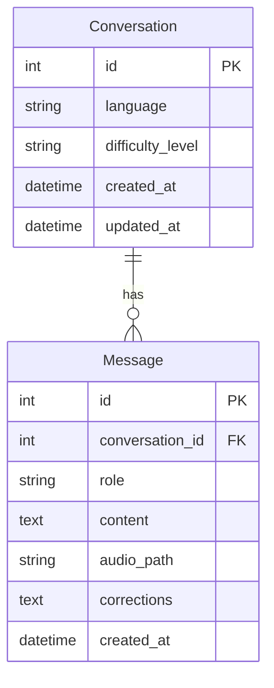
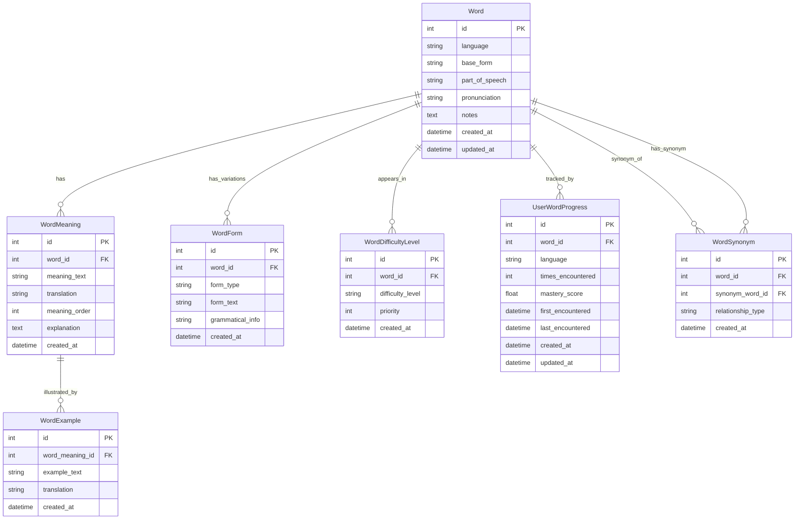
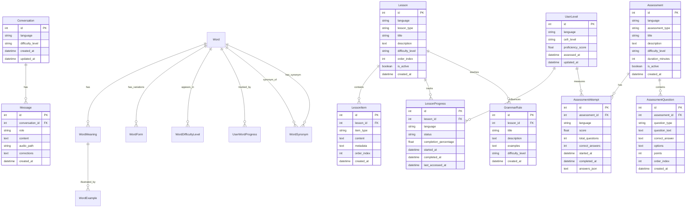

# Database Schema Documentation

This document provides a complete reference for the Babblr database schema, including current and planned models, relationships, constraints, and validation rules.

## Overview

Babblr uses SQLite as the database engine with SQLAlchemy ORM for async operations. The schema is initialized automatically on application startup using `Base.metadata.create_all()`.

**Database File**: `backend/babblr.db`  
**ORM**: SQLAlchemy (async)  
**Initialization**: Automatic via `init_db()` in `backend/app/database/db.py`

## Current Schema (v1)

### Entity Relationship Diagram



### Tables

#### conversations

Stores conversation sessions between the user and the AI language tutor.

| Column | Type | Constraints | Description |
|--------|------|-------------|-------------|
| `id` | INTEGER | PRIMARY KEY, AUTOINCREMENT | Unique conversation identifier |
| `language` | VARCHAR(50) | NOT NULL | Target language code (e.g., "es", "fr", "de") |
| `difficulty_level` | VARCHAR(20) | NOT NULL, DEFAULT 'A1' | CEFR level (A1-C2) or legacy format (beginner/intermediate/advanced) |
| `created_at` | DATETIME | NOT NULL, DEFAULT UTC_NOW | Timestamp when conversation was created |
| `updated_at` | DATETIME | NOT NULL, DEFAULT UTC_NOW, ON UPDATE UTC_NOW | Timestamp when conversation was last modified |

**Relationships**:
- One-to-many with `messages` (cascade delete)

**Indexes**: `id` (primary key)

**Validation Rules**:
- `language` must be a valid ISO 639-1 language code (2 characters)
- `difficulty_level` must be one of: A1, A2, B1, B2, C1, C2, beginner, intermediate, advanced

#### messages

Stores individual messages within a conversation.

| Column | Type | Constraints | Description |
|--------|------|-------------|-------------|
| `id` | INTEGER | PRIMARY KEY, AUTOINCREMENT | Unique message identifier |
| `conversation_id` | INTEGER | NOT NULL, FOREIGN KEY | Reference to parent conversation |
| `role` | VARCHAR(20) | NOT NULL | Message role: 'user' or 'assistant' |
| `content` | TEXT | NOT NULL | Message text content |
| `audio_path` | VARCHAR(255) | NULL | Optional path to audio file for this message |
| `corrections` | TEXT | NULL | JSON string containing grammar/spelling corrections |
| `created_at` | DATETIME | NOT NULL, DEFAULT UTC_NOW | Timestamp when message was created |

**Relationships**:
- Many-to-one with `conversations` (foreign key with cascade delete)

**Indexes**: `id` (primary key), `conversation_id` (foreign key)

**Validation Rules**:
- `role` must be either 'user' or 'assistant'
- `content` cannot be empty
- `corrections` must be valid JSON when provided
- `audio_path` must be a valid file path when provided

## Vocabulary Architecture (Revised)

### Overview

**Current Approach (v1)**: Vocabulary is extracted reactively from conversations as they occur. This is being replaced with a proactive, static vocabulary system.

**New Approach (v2)**: Vocabulary is predefined offline for each difficulty level (e.g., 500 words for A1, 3000 for B1). Conversations are built using this vocabulary, ensuring 90%+ of words match the user's difficulty level. This provides:
- Controlled vocabulary progression
- Consistent difficulty levels
- Better learning outcomes through structured exposure
- Ability to track which words have been encountered

### Technical Considerations

The new vocabulary system addresses:

1. **Multiple Meanings**: Words can have multiple meanings (e.g., "bank" = financial institution or river edge)
2. **Synonyms**: Multiple words can refer to the same concept (language-specific)
3. **Word Variations**: Words have forms (plural, feminine, verb conjugations, etc.)
4. **Language-Specific**: Relationships and variations differ by language

### Architecture



## Planned Schema Extensions (v2)

The following models are planned to support lessons, assessments, progress tracking, and the new static vocabulary system. These will be added incrementally as part of issue #3.

### Planned Entity Relationship Diagram



### Static Vocabulary Tables

The following tables implement the new static vocabulary system where words are predefined by difficulty level and conversations are built using this vocabulary.

#### words

Stores the base vocabulary words for each language. This is the central table for the static vocabulary system.

| Column | Type | Constraints | Description |
|--------|------|-------------|-------------|
| `id` | INTEGER | PRIMARY KEY, AUTOINCREMENT | Unique word identifier |
| `language` | VARCHAR(50) | NOT NULL | Target language code (e.g., "es", "fr", "de") |
| `base_form` | VARCHAR(100) | NOT NULL | Base/dictionary form of the word (e.g., "hablar" for Spanish verb) |
| `part_of_speech` | VARCHAR(50) | NOT NULL | Part of speech: 'noun', 'verb', 'adjective', 'adverb', 'pronoun', 'preposition', 'conjunction', 'interjection' |
| `pronunciation` | VARCHAR(255) | NULL | Phonetic pronunciation guide (IPA or language-specific) |
| `notes` | TEXT | NULL | Additional notes about the word (usage, etymology, etc.) |
| `created_at` | DATETIME | NOT NULL, DEFAULT UTC_NOW | Creation timestamp |
| `updated_at` | DATETIME | NOT NULL, DEFAULT UTC_NOW, ON UPDATE UTC_NOW | Last update timestamp |

**Relationships**:
- One-to-many with `word_meanings` (cascade delete)
- One-to-many with `word_forms` (cascade delete)
- One-to-many with `word_difficulty_levels` (cascade delete)
- One-to-many with `user_word_progress` (cascade delete)
- Many-to-many with `words` via `word_synonyms` (self-referential)

**Indexes**: `id` (primary key), `language`, `base_form`, `language + base_form` (unique composite)

**Validation Rules**:
- `language` must be valid ISO 639-1 language code
- `base_form` cannot be empty
- `part_of_speech` must be one of: 'noun', 'verb', 'adjective', 'adverb', 'pronoun', 'preposition', 'conjunction', 'interjection'
- Combination of `language` + `base_form` must be unique

**Usage**: This table stores the canonical vocabulary. When building conversations, the system queries words by `language` and `difficulty_level` (via `word_difficulty_levels`) to ensure 90%+ of words match the user's level.

#### word_meanings

Stores different meanings/definitions for a word. Handles words with multiple meanings (e.g., "bank" = financial institution or river edge).

| Column | Type | Constraints | Description |
|--------|------|-------------|-------------|
| `id` | INTEGER | PRIMARY KEY, AUTOINCREMENT | Unique meaning identifier |
| `word_id` | INTEGER | NOT NULL, FOREIGN KEY | Reference to parent word |
| `meaning_text` | TEXT | NOT NULL | Definition/meaning in target language |
| `translation` | VARCHAR(255) | NOT NULL | Translation to user's native language (default: English) |
| `meaning_order` | INTEGER | NOT NULL, DEFAULT 1 | Order of this meaning (1 = primary, 2 = secondary, etc.) |
| `explanation` | TEXT | NULL | Extended explanation or context for this meaning |
| `created_at` | DATETIME | NOT NULL, DEFAULT UTC_NOW | Creation timestamp |

**Relationships**:
- Many-to-one with `words` (foreign key with cascade delete)
- One-to-many with `word_examples` (cascade delete)

**Indexes**: `id` (primary key), `word_id` (foreign key), `word_id + meaning_order` (composite)

**Validation Rules**:
- `meaning_text` and `translation` cannot be empty
- `meaning_order` must be >= 1
- Each word should have at least one meaning

**Usage**: Allows words to have multiple meanings. The primary meaning (`meaning_order = 1`) is typically used in conversations, but context can determine which meaning is appropriate.

#### word_forms

Stores grammatical variations of words (plural, feminine, verb conjugations, etc.). Handles language-specific variations.

| Column | Type | Constraints | Description |
|--------|------|-------------|-------------|
| `id` | INTEGER | PRIMARY KEY, AUTOINCREMENT | Unique form identifier |
| `word_id` | INTEGER | NOT NULL, FOREIGN KEY | Reference to parent word |
| `form_type` | VARCHAR(50) | NOT NULL | Type of variation: 'plural', 'feminine', 'masculine', 'conjugation', 'comparative', 'superlative', 'past_tense', 'participle', etc. |
| `form_text` | VARCHAR(100) | NOT NULL | The actual form of the word (e.g., "hablo" for first person singular of "hablar") |
| `grammatical_info` | TEXT | NULL | JSON string with grammatical details (tense, person, number, gender, etc.) |
| `created_at` | DATETIME | NOT NULL, DEFAULT UTC_NOW | Creation timestamp |

**Relationships**:
- Many-to-one with `words` (foreign key with cascade delete)

**Indexes**: `id` (primary key), `word_id` (foreign key), `word_id + form_type + form_text` (composite unique)

**Validation Rules**:
- `form_type` must be a valid form type (language-specific validation)
- `form_text` cannot be empty
- `grammatical_info` must be valid JSON when provided
- Combination of `word_id` + `form_type` + `form_text` must be unique

**Usage**: Stores all variations of a word. When matching words in conversations, the system can recognize both base forms and variations. For example, "gatos" (plural) and "gato" (singular) both link to the same word entry.

#### word_difficulty_levels

Associates words with CEFR difficulty levels. A word can appear in multiple levels (e.g., a word might be introduced in A1 but also used in B1).

| Column | Type | Constraints | Description |
|--------|------|-------------|-------------|
| `id` | INTEGER | PRIMARY KEY, AUTOINCREMENT | Unique association identifier |
| `word_id` | INTEGER | NOT NULL, FOREIGN KEY | Reference to word |
| `difficulty_level` | VARCHAR(20) | NOT NULL | CEFR level: 'A1', 'A2', 'B1', 'B2', 'C1', 'C2' |
| `priority` | INTEGER | NOT NULL, DEFAULT 1 | Priority within level (1 = high priority, higher = lower priority). Used for word selection in conversations. |
| `created_at` | DATETIME | NOT NULL, DEFAULT UTC_NOW | Creation timestamp |

**Relationships**:
- Many-to-one with `words` (foreign key with cascade delete)

**Indexes**: `id` (primary key), `word_id` (foreign key), `difficulty_level`, `word_id + difficulty_level` (composite unique)

**Validation Rules**:
- `difficulty_level` must be valid CEFR level (A1, A2, B1, B2, C1, C2)
- `priority` must be >= 1
- Combination of `word_id` + `difficulty_level` must be unique

**Usage**: This is the key table for vocabulary-based conversation generation. When building a conversation for A1 level, the system queries words where `difficulty_level = 'A1'` and selects words based on `priority` and user progress. Target: ~500 words for A1, ~1000 for A2, ~3000 for B1, etc.

#### word_synonyms

Stores synonym relationships between words. Handles cases where multiple words refer to the same concept (language-specific).

| Column | Type | Constraints | Description |
|--------|------|-------------|-------------|
| `id` | INTEGER | PRIMARY KEY, AUTOINCREMENT | Unique synonym relationship identifier |
| `word_id` | INTEGER | NOT NULL, FOREIGN KEY | First word in the relationship |
| `synonym_word_id` | INTEGER | NOT NULL, FOREIGN KEY | Synonym word (reference to another word) |
| `relationship_type` | VARCHAR(50) | NOT NULL, DEFAULT 'synonym' | Type: 'synonym' (same meaning), 'near_synonym' (similar meaning), 'antonym' (opposite meaning) |
| `created_at` | DATETIME | NOT NULL, DEFAULT UTC_NOW | Creation timestamp |

**Relationships**:
- Many-to-one with `words` (as `word_id`, foreign key)
- Many-to-one with `words` (as `synonym_word_id`, foreign key)

**Indexes**: `id` (primary key), `word_id` (foreign key), `synonym_word_id` (foreign key), `word_id + synonym_word_id` (composite unique)

**Validation Rules**:
- `word_id` and `synonym_word_id` must be different
- `relationship_type` must be one of: 'synonym', 'near_synonym', 'antonym'
- Combination of `word_id` + `synonym_word_id` must be unique
- Both words must be in the same language

**Usage**: Helps understand word relationships. Can be used to suggest alternative words in conversations or explain word connections to learners.

#### word_examples

Stores example sentences illustrating word meanings. Provides context for how words are used.

| Column | Type | Constraints | Description |
|--------|------|-------------|-------------|
| `id` | INTEGER | PRIMARY KEY, AUTOINCREMENT | Unique example identifier |
| `word_meaning_id` | INTEGER | NOT NULL, FOREIGN KEY | Reference to word meaning this example illustrates |
| `example_text` | TEXT | NOT NULL | Example sentence in target language |
| `translation` | TEXT | NULL | Translation of the example to user's native language |
| `created_at` | DATETIME | NOT NULL, DEFAULT UTC_NOW | Creation timestamp |

**Relationships**:
- Many-to-one with `word_meanings` (foreign key with cascade delete)

**Indexes**: `id` (primary key), `word_meaning_id` (foreign key)

**Validation Rules**:
- `example_text` cannot be empty
- Each word meaning should have at least one example

**Usage**: Provides context for word usage. Examples can be shown to learners when they encounter a word, or used to generate conversation prompts.

#### user_word_progress

Tracks user progress with individual words. Records which words have been encountered and how well they're mastered.

| Column | Type | Constraints | Description |
|--------|------|-------------|-------------|
| `id` | INTEGER | PRIMARY KEY, AUTOINCREMENT | Unique progress record identifier |
| `word_id` | INTEGER | NOT NULL, FOREIGN KEY | Reference to word |
| `language` | VARCHAR(50) | NOT NULL | Target language code (denormalized for query performance) |
| `times_encountered` | INTEGER | NOT NULL, DEFAULT 0 | Number of times user has seen this word in conversations |
| `mastery_score` | FLOAT | NOT NULL, DEFAULT 0.0 | Mastery score (0.0-100.0) based on correct usage, recognition, etc. |
| `first_encountered` | DATETIME | NULL | When user first encountered this word |
| `last_encountered` | DATETIME | NULL | When user last encountered this word |
| `created_at` | DATETIME | NOT NULL, DEFAULT UTC_NOW | Creation timestamp |
| `updated_at` | DATETIME | NOT NULL, DEFAULT UTC_NOW, ON UPDATE UTC_NOW | Last update timestamp |

**Relationships**:
- Many-to-one with `words` (foreign key with cascade delete)

**Indexes**: `id` (primary key), `word_id` (foreign key), `language`, `word_id + language` (composite unique)

**Validation Rules**:
- `times_encountered` must be >= 0
- `mastery_score` must be between 0.0 and 100.0
- `last_encountered` must be >= `first_encountered` when both are set
- Combination of `word_id` + `language` must be unique

**Usage**: Tracks which words the user has seen and how well they know them. Used to:
- Prioritize words in conversations (focus on words with low `mastery_score`)
- Avoid repeating recently encountered words
- Generate progress reports
- Determine when to introduce new difficulty levels

### Conversation-Vocabulary Integration

**Architecture Change**: Conversations are now built using the static vocabulary system instead of extracting vocabulary reactively.

#### How It Works

1. **Conversation Generation** (when creating a conversation for difficulty level X):
   ```sql
   -- Get vocabulary words for the user's level
   SELECT w.* FROM words w
   JOIN word_difficulty_levels wdl ON w.id = wdl.word_id
   LEFT JOIN user_word_progress uwp ON w.id = uwp.word_id
   WHERE w.language = :language
     AND wdl.difficulty_level = :level
   ORDER BY 
     COALESCE(uwp.mastery_score, 0) ASC,  -- Prioritize words with low mastery
     wdl.priority ASC,                     -- Then by priority
     COALESCE(uwp.last_encountered, '1970-01-01') ASC  -- Then by recency
   LIMIT :word_count;
   ```

2. **LLM Prompt Enhancement**: The selected vocabulary words are passed to the LLM in the system prompt:
   - "Use these words in the conversation: [word list]"
   - "90% of words in your responses should come from this vocabulary"
   - "Introduce new words gradually based on user comprehension"

3. **Progress Tracking** (when words appear in conversation):
   - Update `user_word_progress.times_encountered` (+1)
   - Update `user_word_progress.last_encountered` (current timestamp)
   - Update `user_word_progress.mastery_score` (based on user's correct usage)
   - Set `user_word_progress.first_encountered` if this is the first time

4. **Word Recognition**: When processing user input or AI responses:
   - Match words against `words.base_form` and `word_forms.form_text`
   - Link recognized words to their base form
   - Track which words were used in the conversation

#### Benefits

- **Controlled Progression**: Users encounter words in a structured order (A1 → A2 → B1, etc.)
- **Consistent Difficulty**: 90%+ of words match the user's level, preventing frustration
- **Progress Tracking**: System knows exactly which words user has seen and how well they know them
- **Adaptive Learning**: Focus on words with low mastery scores
- **Offline Preparation**: Vocabulary can be curated and validated offline before use

#### Vocabulary Size Targets

- **A1**: ~500 words (basic vocabulary for simple conversations)
- **A2**: ~1,000 words (expanded basic vocabulary)
- **B1**: ~3,000 words (intermediate vocabulary)
- **B2**: ~5,000 words (upper-intermediate vocabulary)
- **C1**: ~8,000 words (advanced vocabulary)
- **C2**: ~10,000+ words (proficient vocabulary)

These targets ensure users have sufficient vocabulary at each level while maintaining manageable learning progression.

### Planned Tables

#### lessons

Stores structured lesson content for vocabulary and grammar.

| Column | Type | Constraints | Description |
|--------|------|-------------|-------------|
| `id` | INTEGER | PRIMARY KEY, AUTOINCREMENT | Unique lesson identifier |
| `language` | VARCHAR(50) | NOT NULL | Target language code |
| `lesson_type` | VARCHAR(50) | NOT NULL | Type: 'vocabulary' or 'grammar' |
| `title` | VARCHAR(200) | NOT NULL | Lesson title |
| `description` | TEXT | NULL | Lesson description |
| `difficulty_level` | VARCHAR(20) | NOT NULL, DEFAULT 'A1' | CEFR difficulty level |
| `order_index` | INTEGER | NOT NULL, DEFAULT 0 | Display order within lesson type |
| `is_active` | BOOLEAN | NOT NULL, DEFAULT TRUE | Whether lesson is available |
| `created_at` | DATETIME | NOT NULL, DEFAULT UTC_NOW | Creation timestamp |

**Relationships**:
- One-to-many with `lesson_items` (cascade delete)
- One-to-many with `lesson_progress` (cascade delete)
- One-to-many with `grammar_rules` (cascade delete)

**Validation Rules**:
- `lesson_type` must be 'vocabulary' or 'grammar'
- `difficulty_level` must be valid CEFR level
- `order_index` must be >= 0

#### lesson_items

Stores individual items (words, phrases, exercises) within a lesson.

| Column | Type | Constraints | Description |
|--------|------|-------------|-------------|
| `id` | INTEGER | PRIMARY KEY, AUTOINCREMENT | Unique item identifier |
| `lesson_id` | INTEGER | NOT NULL, FOREIGN KEY | Reference to parent lesson |
| `item_type` | VARCHAR(50) | NOT NULL | Type: 'word', 'phrase', 'exercise', 'example' |
| `content` | TEXT | NOT NULL | Item content (JSON or text) |
| `metadata` | TEXT | NULL | Additional metadata (JSON) |
| `order_index` | INTEGER | NOT NULL, DEFAULT 0 | Display order within lesson |
| `created_at` | DATETIME | NOT NULL, DEFAULT UTC_NOW | Creation timestamp |

**Relationships**:
- Many-to-one with `lessons` (foreign key with cascade delete)

**Validation Rules**:
- `item_type` must be one of: 'word', 'phrase', 'exercise', 'example'
- `content` cannot be empty
- `metadata` must be valid JSON when provided

#### lesson_progress

Tracks user progress through lessons.

| Column | Type | Constraints | Description |
|--------|------|-------------|-------------|
| `id` | INTEGER | PRIMARY KEY, AUTOINCREMENT | Unique progress record identifier |
| `lesson_id` | INTEGER | NOT NULL, FOREIGN KEY | Reference to lesson |
| `language` | VARCHAR(50) | NOT NULL | Target language code |
| `status` | VARCHAR(20) | NOT NULL, DEFAULT 'not_started' | Status: 'not_started', 'in_progress', 'completed' |
| `completion_percentage` | FLOAT | NOT NULL, DEFAULT 0.0 | Completion percentage (0.0-100.0) |
| `started_at` | DATETIME | NULL | When user started the lesson |
| `completed_at` | DATETIME | NULL | When user completed the lesson |
| `last_accessed_at` | DATETIME | NOT NULL, DEFAULT UTC_NOW | Last access timestamp |

**Relationships**:
- Many-to-one with `lessons` (foreign key with cascade delete)

**Validation Rules**:
- `status` must be one of: 'not_started', 'in_progress', 'completed'
- `completion_percentage` must be between 0.0 and 100.0
- `completed_at` must be NULL or >= `started_at` when both are set

#### grammar_rules

Stores grammar rules associated with lessons.

| Column | Type | Constraints | Description |
|--------|------|-------------|-------------|
| `id` | INTEGER | PRIMARY KEY, AUTOINCREMENT | Unique grammar rule identifier |
| `lesson_id` | INTEGER | NOT NULL, FOREIGN KEY | Reference to lesson |
| `title` | VARCHAR(200) | NOT NULL | Rule title |
| `description` | TEXT | NOT NULL | Rule explanation |
| `examples` | TEXT | NULL | Example sentences (JSON array) |
| `difficulty_level` | VARCHAR(20) | NOT NULL, DEFAULT 'A1' | CEFR difficulty level |
| `created_at` | DATETIME | NOT NULL, DEFAULT UTC_NOW | Creation timestamp |

**Relationships**:
- Many-to-one with `lessons` (foreign key with cascade delete)

**Validation Rules**:
- `title` and `description` cannot be empty
- `examples` must be valid JSON array when provided
- `difficulty_level` must be valid CEFR level

#### assessments

Stores assessment tests for proficiency evaluation.

| Column | Type | Constraints | Description |
|--------|------|-------------|-------------|
| `id` | INTEGER | PRIMARY KEY, AUTOINCREMENT | Unique assessment identifier |
| `language` | VARCHAR(50) | NOT NULL | Target language code |
| `assessment_type` | VARCHAR(50) | NOT NULL | Type: 'cefr_placement', 'vocabulary', 'grammar', 'comprehensive' |
| `title` | VARCHAR(200) | NOT NULL | Assessment title |
| `description` | TEXT | NULL | Assessment description |
| `difficulty_level` | VARCHAR(20) | NOT NULL | Target CEFR level |
| `duration_minutes` | INTEGER | NULL | Estimated duration in minutes |
| `is_active` | BOOLEAN | NOT NULL, DEFAULT TRUE | Whether assessment is available |
| `created_at` | DATETIME | NOT NULL, DEFAULT UTC_NOW | Creation timestamp |

**Relationships**:
- One-to-many with `assessment_questions` (cascade delete)
- One-to-many with `assessment_attempts` (cascade delete)

**Validation Rules**:
- `assessment_type` must be one of: 'cefr_placement', 'vocabulary', 'grammar', 'comprehensive'
- `difficulty_level` must be valid CEFR level
- `duration_minutes` must be > 0 when provided

#### assessment_questions

Stores questions within an assessment.

| Column | Type | Constraints | Description |
|--------|------|-------------|-------------|
| `id` | INTEGER | PRIMARY KEY, AUTOINCREMENT | Unique question identifier |
| `assessment_id` | INTEGER | NOT NULL, FOREIGN KEY | Reference to parent assessment |
| `question_type` | VARCHAR(50) | NOT NULL | Type: 'multiple_choice', 'fill_blank', 'translation', 'grammar' |
| `question_text` | TEXT | NOT NULL | Question text |
| `correct_answer` | TEXT | NOT NULL | Correct answer |
| `options` | TEXT | NULL | Answer options (JSON array for multiple choice) |
| `points` | INTEGER | NOT NULL, DEFAULT 1 | Points awarded for correct answer |
| `order_index` | INTEGER | NOT NULL, DEFAULT 0 | Display order within assessment |
| `created_at` | DATETIME | NOT NULL, DEFAULT UTC_NOW | Creation timestamp |

**Relationships**:
- Many-to-one with `assessments` (foreign key with cascade delete)

**Validation Rules**:
- `question_type` must be one of: 'multiple_choice', 'fill_blank', 'translation', 'grammar'
- `question_text` and `correct_answer` cannot be empty
- `options` must be valid JSON array when provided (required for multiple_choice)
- `points` must be > 0

#### assessment_attempts

Stores user attempts at assessments.

| Column | Type | Constraints | Description |
|--------|------|-------------|-------------|
| `id` | INTEGER | PRIMARY KEY, AUTOINCREMENT | Unique attempt identifier |
| `assessment_id` | INTEGER | NOT NULL, FOREIGN KEY | Reference to assessment |
| `language` | VARCHAR(50) | NOT NULL | Target language code |
| `score` | FLOAT | NOT NULL | Score percentage (0.0-100.0) |
| `total_questions` | INTEGER | NOT NULL | Total number of questions |
| `correct_answers` | INTEGER | NOT NULL | Number of correct answers |
| `started_at` | DATETIME | NOT NULL, DEFAULT UTC_NOW | When attempt started |
| `completed_at` | DATETIME | NULL | When attempt completed |
| `answers_json` | TEXT | NULL | User answers (JSON object) |

**Relationships**:
- Many-to-one with `assessments` (foreign key)

**Validation Rules**:
- `score` must be between 0.0 and 100.0
- `correct_answers` must be <= `total_questions`
- `total_questions` must be > 0
- `answers_json` must be valid JSON when provided
- `completed_at` must be >= `started_at` when set

#### user_levels

Stores user proficiency level per language.

| Column | Type | Constraints | Description |
|--------|------|-------------|-------------|
| `id` | INTEGER | PRIMARY KEY, AUTOINCREMENT | Unique level record identifier |
| `language` | VARCHAR(50) | NOT NULL, UNIQUE | Target language code (one record per language) |
| `cefr_level` | VARCHAR(20) | NOT NULL, DEFAULT 'A1' | Current CEFR level |
| `proficiency_score` | FLOAT | NOT NULL, DEFAULT 0.0 | Numeric proficiency score (0.0-100.0) |
| `assessed_at` | DATETIME | NOT NULL, DEFAULT UTC_NOW | When level was last assessed |
| `updated_at` | DATETIME | NOT NULL, DEFAULT UTC_NOW, ON UPDATE UTC_NOW | Last update timestamp |

**Relationships**:
- Influences `lesson_progress` recommendations
- Updated by `assessment_attempts` results

**Validation Rules**:
- `language` must be valid ISO 639-1 code
- `cefr_level` must be valid CEFR level (A1-C2)
- `proficiency_score` must be between 0.0 and 100.0
- `updated_at` must be >= `assessed_at`

## Database Initialization

The database is initialized automatically when the FastAPI application starts via the `lifespan` context manager in `backend/app/main.py`:

```python
@asynccontextmanager
async def lifespan(app: FastAPI):
    """Initialize database on startup."""
    await init_db()
    yield
```

The `init_db()` function in `backend/app/database/db.py`:
- Imports all models to register them with `Base.metadata`
- Uses `Base.metadata.create_all()` to create tables (idempotent operation)
- Only creates tables that don't already exist

## Migration Strategy

Currently, Babblr uses `Base.metadata.create_all()` for schema initialization. This approach:
- ✅ Works well for development and single-user desktop applications
- ✅ Automatically creates new tables
- ⚠️ Does not handle schema changes to existing tables (adds new columns but doesn't modify existing ones)
- ⚠️ Does not support rollback or version tracking

**Future Consideration**: For production or multi-user scenarios, consider migrating to Alembic for proper database migrations.

## Validation and Constraints

### Application-Level Validation

All database models should have corresponding Pydantic schemas in `backend/app/models/schemas.py` for:
- Input validation before database operations
- Type checking and serialization
- API request/response models

### Database-Level Constraints

SQLAlchemy models enforce:
- Primary keys (auto-increment)
- Foreign keys with referential integrity
- NOT NULL constraints
- Default values
- Cascade delete relationships

### Recommended Validation Rules

When implementing new models, ensure:

1. **Required Fields**: All NOT NULL columns have validation
2. **Enum Values**: String fields with limited options use validation (e.g., CEFR levels, status values)
3. **Range Checks**: Numeric fields have min/max validation (e.g., percentages 0-100)
4. **Format Validation**: String fields with specific formats are validated (e.g., ISO language codes, JSON)
5. **Relationship Integrity**: Foreign keys reference existing records
6. **Temporal Logic**: Date/time fields have logical constraints (e.g., `completed_at >= started_at`)

## Best Practices

### Adding New Models

1. **Define SQLAlchemy Model**: Add to `backend/app/models/models.py`
   - Include proper docstrings
   - Define relationships with cascade rules
   - Set appropriate defaults

2. **Create Pydantic Schemas**: Add to `backend/app/models/schemas.py`
   - `ModelCreate` for creation
   - `ModelResponse` for reading
   - Include validation rules

3. **Update Documentation**: Update this file with:
   - Table description
   - Column definitions
   - Relationships
   - Validation rules

4. **Add Tests**: Create tests in `backend/tests/` to verify:
   - Model creation
   - Relationships work correctly
   - Validation rules are enforced

5. **Update ER Diagram**: Update the mermaid diagram in this document

### Query Patterns

- Use async sessions: `async with AsyncSessionLocal() as session:`
- Always use transactions for multi-step operations
- Use `select()` for queries (SQLAlchemy 2.0 style)
- Avoid N+1 queries by using `joinedload()` or `selectinload()`

### Performance Considerations

- Index foreign keys (automatic with SQLAlchemy)
- Consider additional indexes for frequently queried columns
- Use `expire_on_commit=False` for read-heavy operations
- Batch operations when inserting multiple records

## References

- **SQLAlchemy Documentation**: https://docs.sqlalchemy.org/
- **Pydantic Documentation**: https://docs.pydantic.dev/
- **CEFR Levels**: https://www.coe.int/en/web/common-european-framework-reference-languages/level-descriptions
- **ISO 639-1 Language Codes**: https://en.wikipedia.org/wiki/List_of_ISO_639-1_codes

---

*Last updated: 2025-01-12*  
*Schema version: 1.0 (current), 2.0 (planned)*
