# Stakeholder Overview

## Purpose

This document identifies all stakeholders in the Babblr ecosystem, maps their relationships, and outlines the engagement strategy for each group.

## Stakeholder Identification

Babblr serves four primary stakeholder groups:

### 1. Students (Primary Users)
**Who**: Self-directed language learners practicing conversation

**Needs**:
- Effective conversation practice
- Measurable progress
- Affordable, accessible learning
- Privacy and data control

**Priority**: **Highest** - Students are the primary users and reason Babblr exists

**Document**: [students.md](students.md)

### 2. Tutors (Future Stakeholders)
**Who**: Human language tutors who may use Babblr for student analytics or content creation

**Needs**:
- Learning insights (common student mistakes)
- Content creation tools
- Integration with tutoring workflows

**Priority**: **Medium** - Future feature set, not currently implemented

**Document**: [tutors.md](tutors.md)

### 3. Project Owner (Business)
**Who**: The individual or entity maintaining intellectual property rights and business sustainability

**Needs**:
- Intellectual property protection (copyrights, trademarks)
- Sustainable revenue model
- Commercial licensing enforcement
- Community growth while protecting commercial interests

**Priority**: **High** - Ensures long-term project viability

**Document**: [project-owner.md](project-owner.md)

### 4. Contributors (Open Source Community)
**Who**: Developers, designers, QA testers, documentation writers, translators who contribute to Babblr

**Needs**:
- Clear contribution guidelines
- Responsive maintainers
- Recognition and community
- AI-assisted coding support

**Priority**: **High** - Contributors drive innovation and quality

**Document**: [contributors.md](contributors.md)

## Stakeholder Mapping

### Influence vs. Interest Matrix

```mermaid
graph TD
    A[High Influence, High Interest] --> B[Students]
    A --> C[Project Owner]
    D[High Influence, Low Interest] --> E[None currently]
    F[Low Influence, High Interest] --> G[Contributors]
    F --> H[Early Adopters]
    I[Low Influence, Low Interest] --> J[Tutors - future]
```

### Relationships

## Stakeholder Needs Summary

| Stakeholder | Top 3 Needs | How Babblr Addresses |
|-------------|-------------|---------------------|
| **Students** | 1. Conversation practice 2. Measurable progress 3. Privacy | 1. AI-powered conversations 2. CEFR levels, assessments 3. Local-first, user-controlled data |
| **Tutors** | 1. Student insights 2. Content tools 3. Integration | 1. Future analytics dashboards 2. Future content creation tools 3. Future API for integrations |
| **Project Owner** | 1. IP protection 2. Revenue model 3. Community growth | 1. Dual licensing, CLA, trademarks 2. Commercial licensing revenue 3. Contributor-friendly processes |
| **Contributors** | 1. Clear guidelines 2. Responsive maintainers 3. Recognition | 1. CLAUDE.md, POLICIES.md, CONTRIBUTING.md 2. <48hr issue response target 3. Credits, changelog mentions |

## Engagement Strategy

### Students

**Primary Channel**: GitHub Issues, Discussions, future Discord/forum

**Engagement Approach**:
1. **Listen**: Monitor feedback, feature requests, bug reports
2. **Validate**: User testing, surveys, conversation quality ratings
3. **Communicate**: Clear roadmap, release notes, feature announcements
4. **Support**: Documentation, troubleshooting guides, FAQ

**Frequency**: Continuous (issue monitoring), quarterly surveys

**Owner**: Product Management

### Tutors (Future)

**Primary Channel**: TBD (likely separate outreach when ready)

**Engagement Approach**:
1. **Research**: Understand tutor workflows and pain points
2. **Co-design**: Involve tutors in designing analytics and content tools
3. **Pilot**: Beta test with 5-10 tutors before broader rollout
4. **Support**: Dedicated documentation and support channels

**Frequency**: When tutor features are prioritized (2027+)

**Owner**: Product Management, Business Development

### Project Owner

**Primary Channel**: Direct (internal)

**Engagement Approach**:
1. **Strategic Reviews**: Quarterly alignment on vision, goals, priorities
2. **Financial Reviews**: Monthly revenue tracking, licensing pipeline
3. **Legal Reviews**: Ongoing IP protection, CLA enforcement, licensing negotiations
4. **Risk Management**: Identify and mitigate business risks

**Frequency**: Weekly operational, monthly financial, quarterly strategic

**Owner**: Project Owner (self)

### Contributors

**Primary Channel**: GitHub, future Discord/Slack

**Engagement Approach**:
1. **Onboarding**: Clear CONTRIBUTING.md, CLAUDE.md, good-first-issue labels
2. **Communication**: Issue/PR responses <48hrs, monthly contributor calls
3. **Recognition**: Credits in CHANGELOG, contributor spotlights, path to committer
4. **Support**: Code review, architectural guidance, pairing sessions

**Frequency**: Continuous (GitHub), monthly calls, quarterly retrospectives

**Owner**: Technical Lead, Community Manager (future)

## Potential Conflicts and Resolutions

### Student Privacy vs. Tutor Analytics
**Conflict**: Students want privacy; tutors want insights into student performance

**Resolution**:
- Students must explicitly opt-in to share data with tutors
- Anonymized, aggregated data only (no PII)
- Students control what data is shared and can revoke access
- Clear privacy policies and consent flows

### Open Source vs. Commercial Interests
**Conflict**: Contributors want fully open; project owner needs revenue

**Resolution**:
- Dual licensing (AGPL-3.0 + Commercial) clearly communicated
- CLA ensures both open-source and commercial use
- Transparent about business model in LICENSING.md
- Contributors benefit from sustainable, well-maintained project

### Feature Requests vs. Strategic Focus
**Conflict**: Students/contributors request features outside roadmap

**Resolution**:
- Transparent roadmap in [story-backlog.md](../02-user-stories/story-backlog.md)
- Clear decision framework in [product-principles.md](../00-vision/product-principles.md)
- Rejected features documented with rationale in [rejected-features.md](../08-decisions/rejected-features.md)
- Community can fork if fundamentally different vision

### Contributor Effort vs. CLA Friction
**Conflict**: CLA requirement adds friction for contributors

**Resolution**:
- Clearly explain CLA rationale (dual licensing, sustainability)
- Lightweight CLA process (GitHub integration)
- Acknowledge trade-off in [trade-offs.md](../08-decisions/trade-offs.md)
- Provide alternative: Contributors can use AGPL-licensed code without CLA for non-commercial purposes

## Communication Plan

### Regular Communications

| Audience | Content | Channel | Frequency | Owner |
|----------|---------|---------|-----------|-------|
| Students | Feature updates, tips | Blog, Discussions | Monthly | Product Mgmt |
| Students | Release notes | GitHub Releases | Per release | Product Mgmt |
| Contributors | Roadmap updates | GitHub Discussions | Quarterly | Product Mgmt |
| Contributors | Call for contributions | GitHub Issues, Discord | Monthly | Tech Lead |
| Project Owner | Metrics dashboard | Internal | Weekly | Product Mgmt |
| All | Major announcements | GitHub, Discord, Twitter | As needed | Product Mgmt |

### Crisis Communication

If critical issues arise (security vulnerability, data breach, service outage):
1. **Acknowledge** within 1 hour of discovery
2. **Assess** impact and affected users within 4 hours
3. **Communicate** status, impact, and remediation plan within 8 hours
4. **Resolve** issue and communicate resolution
5. **Post-mortem** public post-mortem within 1 week

**Owner**: Technical Lead, Product Management

## Stakeholder Validation

### How to Validate Stakeholder Needs

**Students**:
- Quarterly user surveys (NPS, feature requests, pain points)
- Conversation quality ratings (built into app)
- User interviews (5-10 per quarter)
- GitHub issue analysis (categorize requests, track themes)

**Tutors** (when relevant):
- Tutor interviews (understand workflows, pain points)
- Pilot programs (beta test features with 5-10 tutors)
- Feedback sessions (monthly during tutor feature development)

**Project Owner**:
- Business metrics tracking (revenue, costs, ROI)
- Competitive analysis (quarterly reviews)
- Legal reviews (annual IP audit)

**Contributors**:
- Contributor surveys (annual)
- Retrospectives (quarterly)
- Contribution metrics (PRs, response times, retention)
- Exit interviews (if contributors leave)

## Related Documents

### Detailed Stakeholder Profiles
- [Students](students.md) - Student personas, needs, pain points, motivating lessons
- [Tutors](tutors.md) - Tutor needs (future)
- [Project Owner](project-owner.md) - Business objectives, IP protection, monetization
- [Contributors](contributors.md) - Contributor types, needs, engagement

### Related Strategy Docs
- [Mission & Vision](../00-vision/mission-vision.md) - Strategic alignment
- [Product Principles](../00-vision/product-principles.md) - Decision framework
- [User Stories](../02-user-stories/) - Stakeholder needs translated to stories
- [Business Model](../07-business/business-model.md) - Revenue and sustainability
- [Success Metrics](../07-business/success-metrics.md) - Stakeholder success criteria

---

**Version**: 1.0.0
**Last Updated**: 2026-02-02
**Owner**: Product Management
