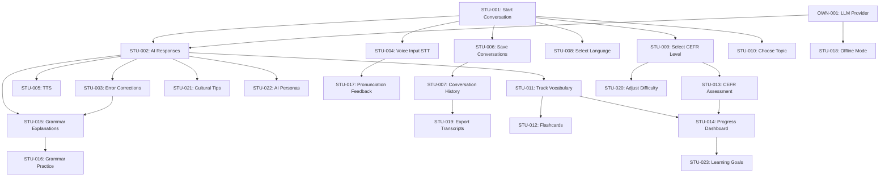

# User Story Backlog

## Purpose

This document contains the prioritized backlog of all user stories for Babblr. Stories are organized by priority (P0-P3) and implementation status (MVP, Current Sprint, Next, Icebox).

For detailed acceptance criteria and story details, see:
- [student-stories.md](student-stories.md)
- [tutor-stories.md](tutor-stories.md)
- [owner-stories.md](owner-stories.md)

## Priority Definitions

| Priority | Definition | Example |
|----------|------------|---------|
| **P0** | Must Have - Core to MVP, blocks other work | Start a conversation |
| **P1** | Should Have - High value, planned for current release | Vocabulary tracking |
| **P2** | Could Have - Nice to have, may be deferred | Grammar lessons |
| **P3** | Won't Have (this release) - Future consideration | Tutor analytics |

## Story Format

Each story follows this format:

```markdown
### [Story ID]: [Story Title]
**As a** [role]
**I want** [capability]
**So that** [benefit]

**Priority**: P0/P1/P2/P3
**Status**: Done / In Progress / Next / Backlog / Icebox
**Effort**: S/M/L (Small/Medium/Large)
**Dependencies**: [Other story IDs or features]
**Sprint**: [Sprint number or version]
```

---

## MVP Stories (Current Focus)

Stories critical to the Minimum Viable Product.

### P0 - Must Have for MVP

#### STU-001: Start a New Conversation
**As a** student
**I want** to start a conversation in my target language at my current proficiency level
**So that** I can practice speaking naturally

**Priority**: P0
**Status**: Done ✓
**Effort**: M
**Dependencies**: None
**Sprint**: MVP-1

---

#### STU-002: Receive AI Responses in Conversation
**As a** student
**I want** the AI tutor to respond naturally to my messages
**So that** I can have a realistic conversation

**Priority**: P0
**Status**: Done ✓
**Effort**: L
**Dependencies**: STU-001
**Sprint**: MVP-1

---

#### STU-003: Get Error Corrections
**As a** student
**I want** the AI to gently correct my grammar and vocabulary mistakes
**So that** I can learn from my errors

**Priority**: P0
**Status**: Done ✓
**Effort**: M
**Dependencies**: STU-002
**Sprint**: MVP-1

---

#### STU-004: Use Voice Input (STT)
**As a** student
**I want** to speak instead of typing
**So that** I can practice pronunciation and speaking fluency

**Priority**: P0
**Status**: Done ✓
**Effort**: L
**Dependencies**: STU-001
**Sprint**: MVP-1

---

#### STU-005: Hear AI Responses (TTS)
**As a** student
**I want** to hear the AI's responses read aloud
**So that** I can improve listening comprehension and pronunciation

**Priority**: P0
**Status**: Done ✓
**Effort**: M
**Dependencies**: STU-002
**Sprint**: MVP-2

---

#### STU-006: Save and Resume Conversations
**As a** student
**I want** to save my conversations and resume them later
**So that** I can continue practicing over multiple sessions

**Priority**: P0
**Status**: Done ✓
**Effort**: M
**Dependencies**: STU-001
**Sprint**: MVP-1

---

#### STU-007: View Conversation History
**As a** student
**I want** to see a list of my past conversations
**So that** I can review what I've practiced

**Priority**: P0
**Status**: Done ✓
**Effort**: S
**Dependencies**: STU-006
**Sprint**: MVP-1

---

#### STU-008: Select Target Language
**As a** student
**I want** to choose which language to practice (Spanish, Italian, German, French, Dutch, English)
**So that** I can learn my desired language

**Priority**: P0
**Status**: Done ✓
**Effort**: S
**Dependencies**: STU-001
**Sprint**: MVP-1

---

#### STU-009: Select CEFR Difficulty Level
**As a** student
**I want** to choose my proficiency level (A1-C2)
**So that** conversations are appropriate for my skill level

**Priority**: P0
**Status**: Done ✓
**Effort**: S
**Dependencies**: STU-001
**Sprint**: MVP-1

---

#### OWN-001: Configure LLM Provider
**As a** project owner
**I want** to support multiple LLM providers (Claude, Gemini, Ollama, Mock)
**So that** users can choose based on cost, privacy, and availability

**Priority**: P0
**Status**: Done ✓
**Effort**: L
**Dependencies**: None
**Sprint**: MVP-1

---

### P1 - Should Have for MVP

#### STU-010: Choose Conversation Topic
**As a** student
**I want** to select a conversation topic (e.g., travel, business, daily life)
**So that** I can practice vocabulary relevant to my interests

**Priority**: P1
**Status**: In Progress
**Effort**: M
**Dependencies**: STU-001
**Sprint**: MVP-3

---

#### STU-011: Track Vocabulary Learned
**As a** student
**I want** to see a list of new words I've learned in conversations
**So that** I can review and reinforce vocabulary

**Priority**: P1
**Status**: In Progress
**Effort**: L
**Dependencies**: STU-002
**Sprint**: MVP-3

---

#### STU-012: Review Vocabulary with Flashcards
**As a** student
**I want** to practice vocabulary using spaced repetition
**So that** I can memorize words more effectively

**Priority**: P1
**Status**: Backlog
**Effort**: L
**Dependencies**: STU-011
**Sprint**: MVP-4

---

#### STU-013: Take CEFR Assessment
**As a** student
**I want** to take a placement test to determine my CEFR level
**So that** I start practicing at the right difficulty

**Priority**: P1
**Status**: Backlog
**Effort**: L
**Dependencies**: STU-009
**Sprint**: MVP-4

---

#### STU-014: View Progress Dashboard
**As a** student
**I want** to see my learning progress (conversations completed, words learned, level)
**So that** I stay motivated and track improvement

**Priority**: P1
**Status**: Backlog
**Effort**: M
**Dependencies**: STU-011, STU-013
**Sprint**: MVP-4

---

## Post-MVP Stories

Stories planned after the MVP is complete.

### P1 - High Priority Post-MVP

#### STU-015: Get Grammar Explanations
**As a** student
**I want** to see grammar rules explained when I make mistakes
**So that** I understand why my sentence was incorrect

**Priority**: P1
**Status**: Next
**Effort**: L
**Dependencies**: STU-003
**Sprint**: v2.0

---

#### STU-016: Practice Specific Grammar Topics
**As a** student
**I want** to practice specific grammar concepts (e.g., past tense, subjunctive)
**So that** I can strengthen weak areas

**Priority**: P1
**Status**: Next
**Effort**: L
**Dependencies**: STU-015
**Sprint**: v2.0

---

#### STU-017: Get Pronunciation Feedback
**As a** student
**I want** the AI to evaluate my pronunciation
**So that** I can improve my accent and clarity

**Priority**: P1
**Status**: Next
**Effort**: L
**Dependencies**: STU-004
**Sprint**: v2.1

---

#### STU-018: Offline Mode with Local LLM
**As a** student
**I want** to use Babblr completely offline using a local LLM (Ollama)
**So that** I can practice without internet and protect my privacy

**Priority**: P1
**Status**: Backlog (Ollama integration done, full offline TBD)
**Effort**: M
**Dependencies**: OWN-001
**Sprint**: v2.2

---

#### STU-019: Export Conversation Transcripts
**As a** student
**I want** to export conversations as text or PDF
**So that** I can share with tutors or keep records

**Priority**: P1
**Status**: Backlog
**Effort**: S
**Dependencies**: STU-007
**Sprint**: v2.2

---

### P2 - Medium Priority Post-MVP

#### STU-020: Adjust Conversation Difficulty Mid-Session
**As a** student
**I want** to adjust the difficulty level during a conversation
**So that** I can make it easier or harder as needed

**Priority**: P2
**Status**: Backlog
**Effort**: M
**Dependencies**: STU-009
**Sprint**: v2.3

---

#### STU-021: Get Cultural Context Tips
**As a** student
**I want** to receive cultural tips during conversations (e.g., formal vs. informal)
**So that** I can communicate appropriately in different contexts

**Priority**: P2
**Status**: Backlog
**Effort**: M
**Dependencies**: STU-002
**Sprint**: v2.3

---

#### STU-022: Practice with Different AI Personas
**As a** student
**I want** to converse with different AI personas (e.g., friendly, formal, humorous)
**So that** I can experience varied conversation styles

**Priority**: P2
**Status**: Backlog
**Effort**: M
**Dependencies**: STU-002
**Sprint**: v2.4

---

#### STU-023: Set Learning Goals
**As a** student
**I want** to set goals (e.g., "10 conversations this week", "learn 50 new words")
**So that** I stay motivated and accountable

**Priority**: P2
**Status**: Backlog
**Effort**: M
**Dependencies**: STU-014
**Sprint**: v2.4

---

#### STU-024: Mobile App (iOS/Android)
**As a** student
**I want** to use Babblr on my phone
**So that** I can practice on the go

**Priority**: P2
**Status**: Icebox
**Effort**: XL
**Dependencies**: MVP complete
**Sprint**: v3.0

---

### P3 - Future Considerations

#### TUT-001: View Student Analytics
**As a** tutor
**I want** to see analytics on student performance (common mistakes, progress)
**So that** I can provide targeted feedback

**Priority**: P3
**Status**: Icebox
**Effort**: L
**Dependencies**: STU-011, STU-013
**Sprint**: TBD

---

#### TUT-002: Create Custom Conversation Topics
**As a** tutor
**I want** to create custom conversation scenarios for my students
**So that** I can tailor practice to their needs

**Priority**: P3
**Status**: Icebox
**Effort**: L
**Dependencies**: STU-010
**Sprint**: TBD

---

#### TUT-003: Create Custom Assessments
**As a** tutor
**I want** to create custom proficiency tests
**So that** I can assess students based on my curriculum

**Priority**: P3
**Status**: Icebox
**Effort**: L
**Dependencies**: STU-013
**Sprint**: TBD

---

#### STU-025: Social Learning / Peer Practice
**As a** student
**I want** to practice with other learners
**So that** I can have real human interaction

**Priority**: P3
**Status**: Rejected (see [rejected-features.md](../08-decisions/rejected-features.md))
**Effort**: XL
**Dependencies**: N/A
**Sprint**: N/A

---

#### STU-026: Cloud Sync Across Devices
**As a** student
**I want** my progress synced across devices
**So that** I can switch between desktop and mobile

**Priority**: P3
**Status**: Rejected (see [rejected-features.md](../08-decisions/rejected-features.md))
**Effort**: L
**Dependencies**: N/A
**Sprint**: N/A

---

## Story Dependencies Graph



## Sprint Planning

### MVP-1 (Complete) ✓
- STU-001: Start conversation
- STU-002: AI responses
- STU-003: Error corrections
- STU-004: Voice input (STT)
- STU-006: Save/resume conversations
- STU-007: Conversation history
- STU-008: Select language
- STU-009: Select CEFR level
- OWN-001: LLM provider support

### MVP-2 (Complete) ✓
- STU-005: TTS (hear responses)

### MVP-3 (In Progress)
- STU-010: Choose conversation topic
- STU-011: Track vocabulary learned

### MVP-4 (Next)
- STU-012: Vocabulary flashcards
- STU-013: CEFR assessment
- STU-014: Progress dashboard

### v2.0 (Post-MVP)
- STU-015: Grammar explanations
- STU-016: Grammar practice

### v2.1
- STU-017: Pronunciation feedback

### v2.2
- STU-018: Full offline mode
- STU-019: Export transcripts

### v2.3
- STU-020: Adjust difficulty mid-session
- STU-021: Cultural tips

### v2.4
- STU-022: AI personas
- STU-023: Learning goals

### v3.0
- STU-024: Mobile app

### Icebox (No Timeline)
- TUT-001: Student analytics
- TUT-002: Custom conversation topics
- TUT-003: Custom assessments

## Prioritization Criteria

Stories are prioritized based on:

1. **User Impact**: How many users benefit? How significant is the benefit?
2. **Strategic Alignment**: Does this align with mission/vision? (See [mission-vision.md](../00-vision/mission-vision.md))
3. **Effort vs. Value**: What's the ROI? (Story points vs. expected impact)
4. **Dependencies**: Does this unblock other high-value work?
5. **Risk**: Does this address a critical risk or technical debt?
6. **Research Validation**: Is this validated by user feedback or language learning research?

## Story Sources

Stories come from:
- **User Feedback**: GitHub issues, surveys, user interviews
- **Stakeholder Needs**: [01-stakeholders/](../01-stakeholders/)
- **Product Vision**: [00-vision/mission-vision.md](../00-vision/mission-vision.md)
- **Competitive Analysis**: [00-vision/market-positioning.md](../00-vision/market-positioning.md)
- **Technical Debt**: Architecture reviews, code quality assessments
- **Research**: Second language acquisition best practices

## Related Documents

- [User Story Overview](overview.md) - Story format and prioritization framework
- [Student Stories](student-stories.md) - Detailed student user stories
- [Tutor Stories](tutor-stories.md) - Detailed tutor user stories (future)
- [Owner Stories](owner-stories.md) - Business/owner user stories
- [Mission & Vision](../00-vision/mission-vision.md) - Strategic alignment
- [Functional Requirements](../04-requirements/functional-requirements.md) - Requirements traceability

---

**Version**: 1.0.0
**Last Updated**: 2026-02-02
**Owner**: Product Management
**Review Frequency**: Weekly (during sprint planning)
