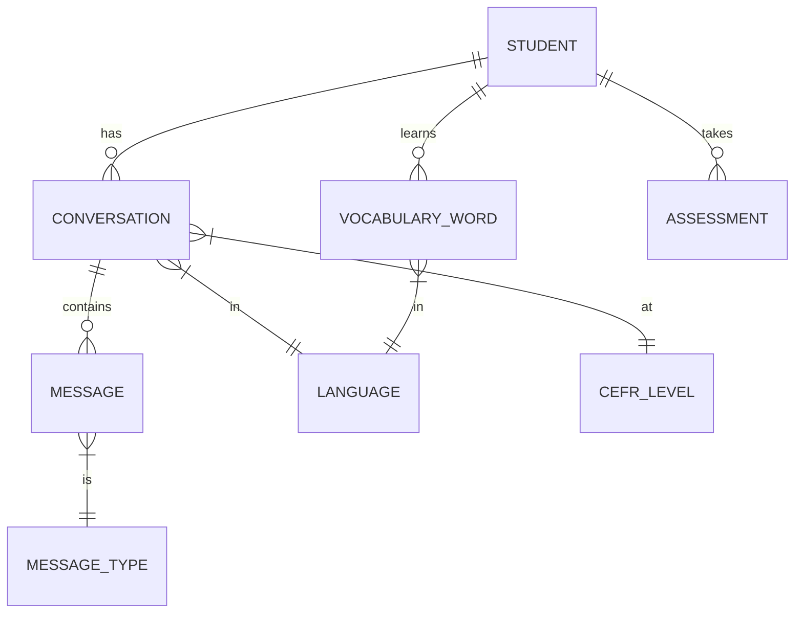

# Domain Model

## Purpose

Defines core entities and relationships in Babblr.

## Core Entities

### Student
- Primary user persona
- Tracks progress, vocabulary, conversations

### Conversation
- Bounded conversation session
- Has language, CEFR level, topic
- Contains messages

### Message
- Single turn in conversation
- Types: user, assistant, system, correction

### Vocabulary Word
- Word/phrase learned in context
- Includes definition, example, mastery score

### Assessment
- CEFR proficiency test
- Provides level recommendation

See [docs/DATABASE_SCHEMA.md](../../DATABASE_SCHEMA.md) for technical schema.

---

**Version**: 1.0.0
**Last Updated**: 2026-02-02
