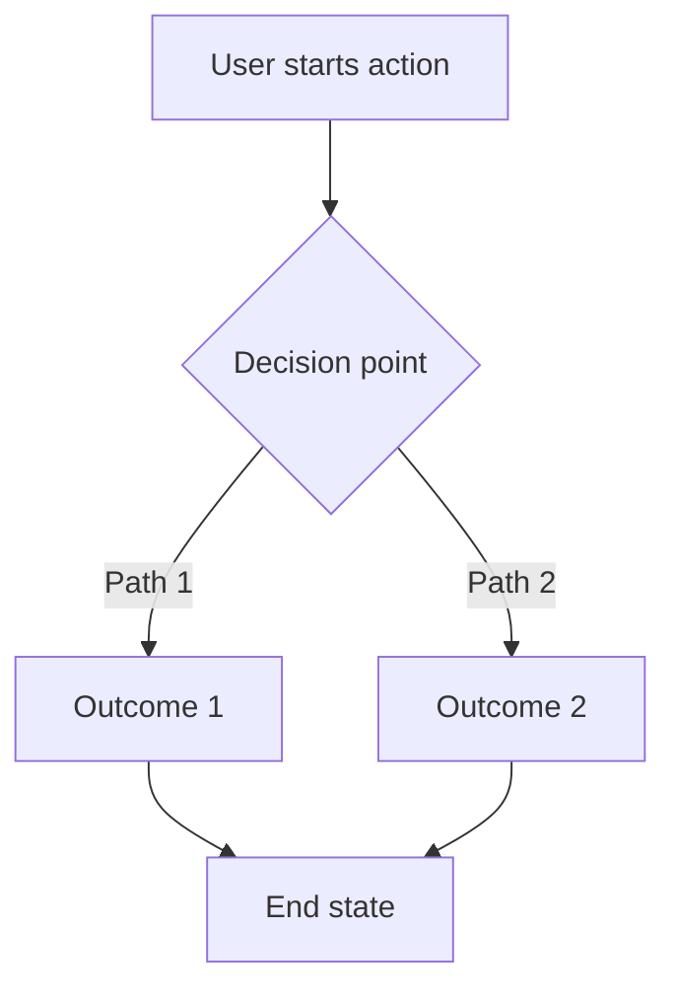

# [Feature Name] - Product Requirements Document

> **Template Instructions**:
> - Replace all [bracketed placeholders] with actual content
> - Remove sections that aren't applicable
> - Delete this instruction block when done
> - Use this template for all feature-specific PRDs in `05-features/`

---

## Document Metadata

| Field | Value |
|-------|-------|
| **Feature Name** | [Feature Name] |
| **Document Owner** | [Name/Role] |
| **Created** | [YYYY-MM-DD] |
| **Last Updated** | [YYYY-MM-DD] |
| **Status** | [Draft / In Review / Approved / Implemented] |
| **Priority** | [P0 / P1 / P2 / P3] |
| **Target Release** | [Version number or date] |

---

## 1. Executive Summary

**TL;DR**: [1-2 sentence description of what this feature is and why it matters]

### Problem Statement
[What problem does this feature solve? Who experiences this problem? How do they currently work around it?]

### Proposed Solution
[High-level description of the solution. What will users be able to do after this feature is implemented?]

### Success Metrics
[How will we measure success? What KPIs will improve?]

| Metric | Current | Target | Measurement Method |
|--------|---------|--------|--------------------|
| [Metric name] | [Baseline] | [Goal] | [How to measure] |

### Strategic Alignment
[How does this feature align with Babblr's mission, vision, and product principles? Reference [00-vision/mission-vision.md](../00-vision/mission-vision.md)]

---

## 2. Background and Context

### User Need
[What user need does this address? Reference relevant stakeholder docs in [01-stakeholders/](../01-stakeholders/)]

### User Research
[Summarize any user research, interviews, surveys, or feedback that informed this feature]

### Competitive Analysis
[How do competitors solve this problem? What can we learn from them?]

### Assumptions
[List key assumptions this PRD is based on]

1. [Assumption 1]
2. [Assumption 2]

---

## 3. User Stories

### Primary User Story
**As a** [user role/persona]
**I want** [capability/goal]
**So that** [benefit/outcome]

**Acceptance Criteria**:
- Given [context/precondition]
- When [action/trigger]
- Then [expected result]

### Additional User Stories
[List all related user stories. Reference [02-user-stories/](../02-user-stories/) if already documented there]

1. Story ID: [Link to story in backlog]
2. Story ID: [Link to story in backlog]

---

## 4. Requirements

### Functional Requirements

| ID | Requirement | Priority | Acceptance Criteria |
|----|-------------|----------|---------------------|
| FR-[X.1] | [System must do X] | [P0/P1/P2/P3] | [How to verify] |
| FR-[X.2] | [System must do Y] | [P0/P1/P2/P3] | [How to verify] |

### Non-Functional Requirements

| ID | Requirement | Target | Measurement |
|----|-------------|--------|-------------|
| NFR-[X.1] | Performance: [metric] | [target value] | [how to measure] |
| NFR-[X.2] | Usability: [metric] | [target value] | [how to measure] |
| NFR-[X.3] | Security: [requirement] | [target] | [verification method] |

### Out of Scope
[Explicitly list what this feature will NOT include]

- [Out of scope item 1]
- [Out of scope item 2]

---

## 5. User Experience

### User Flows
[Describe the primary user flow step-by-step. Use Mermaid diagrams if helpful]



### UI/UX Mockups
[Link to mockups, wireframes, or design files. Describe key UI elements]

### Error States
[How should the system handle errors? What messages should users see?]

| Error Scenario | User-Facing Message | System Behavior |
|----------------|---------------------|-----------------|
| [Scenario 1] | [Error message] | [What happens] |

### Accessibility
[How will this feature meet accessibility standards?]

---

## 6. Technical Design

### Architecture
[High-level technical approach. Reference [06-technical/architecture-requirements.md](../06-technical/architecture-requirements.md)]

### API Specifications
[Define API endpoints, request/response schemas]

**Endpoint**: `[METHOD] /api/[path]`

**Request**:
```json
{
  "field1": "value",
  "field2": 123
}
```

**Response**:
```json
{
  "result": "success",
  "data": {}
}
```

### Data Model
[Describe database schema changes. Reference [docs/DATABASE_SCHEMA.md](../../DATABASE_SCHEMA.md) for existing schema]

**New Tables**:
```sql
CREATE TABLE [table_name] (
  id INTEGER PRIMARY KEY,
  field1 TEXT NOT NULL,
  created_at TIMESTAMP DEFAULT CURRENT_TIMESTAMP
);
```

**Schema Migrations**:
[Describe any changes to existing tables]

### External Dependencies
[List external APIs, libraries, or services required. Reference [04-requirements/integration-requirements.md](../04-requirements/integration-requirements.md)]

| Dependency | Purpose | Version | Documentation |
|------------|---------|---------|---------------|
| [Library/API] | [Why needed] | [Version] | [Link] |

### Security Considerations
[How will this feature handle authentication, authorization, data privacy? Reference [06-technical/security-requirements.md](../06-technical/security-requirements.md)]

### Performance Considerations
[Expected load, response times, scalability. Reference [06-technical/performance-requirements.md](../06-technical/performance-requirements.md)]

---

## 7. Testing Strategy

### Unit Tests
[What units need testing? What edge cases?]

### Integration Tests
[What integration points need testing?]

### End-to-End Tests
[What user flows need E2E coverage?]

### Test Cases
| Test Case ID | Description | Expected Result | Priority |
|--------------|-------------|-----------------|----------|
| TC-[X.1] | [Test scenario] | [Expected outcome] | [P0/P1/P2] |

### Manual Testing Checklist
- [ ] [Manual test 1]
- [ ] [Manual test 2]

---

## 8. Rollout and Launch

### Launch Plan
[How will this feature be released? Phased rollout? Feature flag?]

### Rollback Plan
[What's the plan if something goes wrong?]

### Documentation Updates
[What docs need updating?]

- [ ] User-facing documentation
- [ ] Developer documentation ([CLAUDE.md](../../CLAUDE.md))
- [ ] API documentation
- [ ] Release notes

### Communication Plan
[Who needs to be informed? When?]

| Audience | Message | Channel | Timing |
|----------|---------|---------|--------|
| [Stakeholder group] | [Key message] | [Email/Slack/etc] | [When] |

---

## 9. Success Metrics and Validation

### Success Criteria
[How will we know this feature is successful?]

1. [Criterion 1]: [Target metric]
2. [Criterion 2]: [Target metric]

### Monitoring
[What metrics will we track? What dashboards?]

### User Feedback
[How will we collect user feedback?]

---

## 10. Dependencies and Risks

### Dependencies
[What must be completed before this feature?]

| Dependency | Type | Status | Owner |
|------------|------|--------|-------|
| [Dependency 1] | [Technical/Business] | [Not Started/In Progress/Done] | [Name] |

### Risks
[What could go wrong? How likely? How severe?]

| Risk | Likelihood | Impact | Mitigation Strategy |
|------|------------|--------|---------------------|
| [Risk 1] | [High/Medium/Low] | [High/Medium/Low] | [How to mitigate] |

---

## 11. Open Questions

[List unresolved questions that need answers before implementation]

1. **Q**: [Question]
   **A**: [Answer or "TBD"]
   **Owner**: [Who will answer]

---

## 12. Timeline

### Milestones

| Milestone | Target Date | Status | Notes |
|-----------|-------------|--------|-------|
| PRD Approval | [Date] | [Not Started/In Progress/Done] | |
| Design Complete | [Date] | [Not Started/In Progress/Done] | |
| Development Complete | [Date] | [Not Started/In Progress/Done] | |
| Testing Complete | [Date] | [Not Started/In Progress/Done] | |
| Launch | [Date] | [Not Started/In Progress/Done] | |

### Effort Estimate
[T-shirt size or story points or time estimate]

**Overall Estimate**: [Small / Medium / Large] or [X story points] or [X weeks]

**Breakdown**:
- Design: [estimate]
- Backend: [estimate]
- Frontend: [estimate]
- Testing: [estimate]

---

## 13. Appendix

### References
- [Link to related docs]
- [Link to research]
- [Link to mockups]

### Revision History

| Version | Date | Author | Changes |
|---------|------|--------|---------|
| 1.0 | [YYYY-MM-DD] | [Name] | Initial version |

---

## Approval

| Role | Name | Date | Signature |
|------|------|------|-----------|
| Product Owner | | | |
| Technical Lead | | | |
| Design Lead | | | |

---

**Template Version**: 1.0.0
**Last Updated**: 2026-02-02
